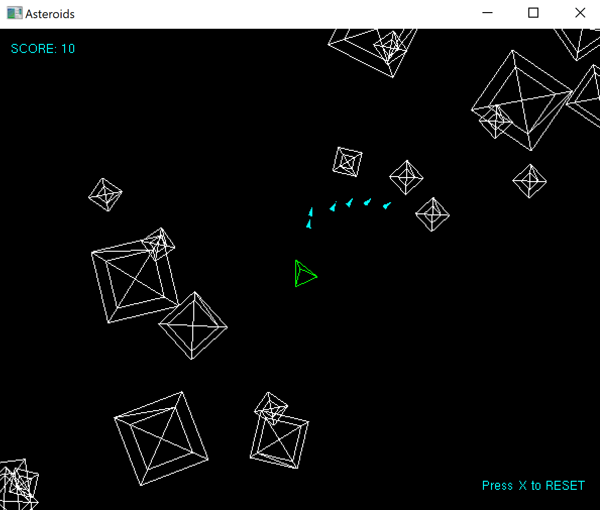

# azulejo-gl-asteroids



## How to Play

s - yaw left
f - yaw right
e - thrust
j - fire
x - reset

## Prerequisites

Checkout [azulejo-common-lib](https://github.com/miclomba/azulejo-common-lib) adjacent to this package.

## Install Dependencies

Install [vcpkg](https://github.com/microsoft/vcpkg). Then run:

```
cd azulejo-gl-asteroids
vcpkg install --x-manifest-root=. --feature-flags=versions,manifests
```

## Build

0. Start Visual Studio
1. Click `continue without code`
2. Set configuration to be `x64-Debug`
3. `File > Open > CMake`
4. If the 'out' directory is not created automatically (Cmake configuration step) then run: `Project > Configure Cache`
5. `Build > Build All`
6. `Build > Install GLAsteroids`

## Run

0. `Select the Startup Item` to be `GLAsteroids.exe`
1. `Debug > Start Debugging`
