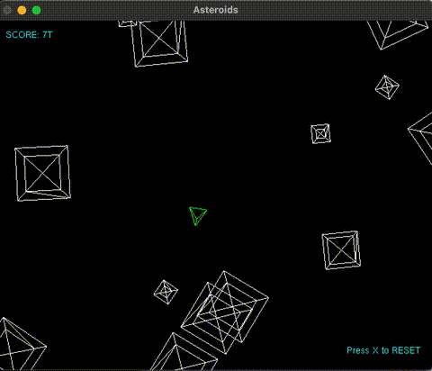

# azulejo-gl-asteroids



## How to Play

- `s` yaw left
- `f` yaw right
- `e` thrust
- `j` fire
- `x` reset

## Prerequisites

Checkout [azulejo-common-lib](https://github.com/miclomba/azulejo-common-lib) adjacent to this package.

#### VSCode

0. Install `VSCode`
1. Install VSCode extensions:

- CMake Tools (by Microsoft)
- C/C++ (by Microsoft)

#### Install VCPKG Dependencies

Install [vcpkg](https://github.com/microsoft/vcpkg).

### Windows

0. Download [Visual Studio Community](https://visualstudio.microsoft.com/vs/community/)
1. Install dependencies: `vcpkg install --x-manifest-root=. --feature-flags=manifests`

### Mac OS

0. Install `XCode`
1. Install `clang` by running: `xcode-select --install`
2. Install build tools: `brew install cmake ninja autoconf automake autoconf-archive libtool pkg-config`
3. FreeGLUT depends on `X11` so install `XQuartz` by running: `brew install --cask xquartz`
4. Install dependencies: `vcpkg install --x-manifest-root=. --feature-flags=manifests`
5. Copy settings `cp .vscode/settings.mac.json .vscode/settings.json`
6. Copy launch settings `cp .vscode/launch.mac.json .vscode/launch.json`

### Ubuntu

0. Install dependencies:

```
sudo apt install -y \
  build-essential autoconf autoconf-archive automake libtool pkg-config cmake git unzip ninja-build curl \
  libssl-dev zlib1g-dev libbz2-dev libreadline-dev libsqlite3-dev libncursesw5-dev libffi-dev \
  libgdbm-dev liblzma-dev uuid-dev tk-dev xz-utils wget libgomp1
  libgl1-mesa-dev libglu1-mesa-dev libx11-dev libxrandr-dev libxi-dev libxmu-dev libxxf86vm-dev
```

1. Copy settings `cp .vscode/settings.linux.json .vscode/settings.json`
2. Copy launch settings `cp .vscode/launch.linux.json .vscode/launch.json`

## Build

### On Windows (Visual Studio)

0. Start Visual Studio
1. Click `continue without code`
2. Set configuration to be `x64-Debug`
3. `File > Open > CMake`
4. If the 'out' directory is not created automatically (Cmake configuration step) then run: `Project > Configure Cache`
5. `Build > Build All`
6. `Build > Install GLAsteroids`

### On macOS or Ubuntu (VSCode)

0. Run `CMake: Configure` command and use the appropriate compiler:

- Clang (on macOS)
- GCC (on Linux)
- Visual Studio (on Windows)

1. Run `CMake: Build`

## Run

### On Windows (Visual Studio)

0. `Select the Startup Item` to be `GLAsteroids.exe`
1. `Debug > Start Debugging`

### On macOS or Ubuntu (VSCode)

0. Run `Start Debugging` with `GLAsteroids` configuration
