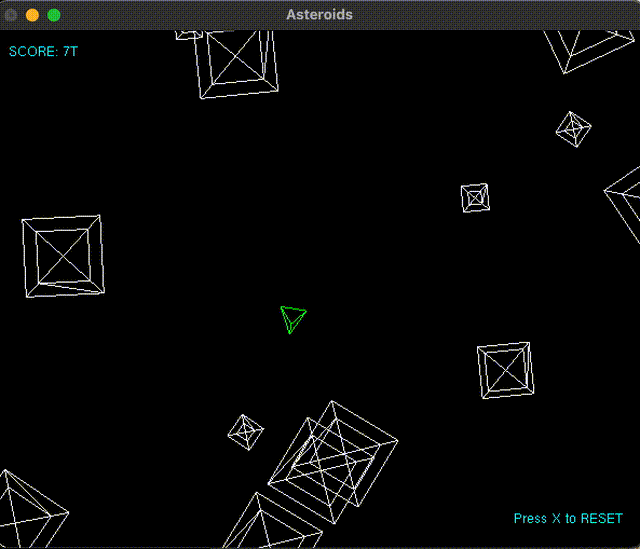

# azulejo-gl-asteroids

## How to Play

- `s` yaw left
- `f` yaw right
- `e` thrust
- `j` fire
- `x` reset

## Prerequisites

Checkout [azulejo-common-lib](https://github.com/miclomba/azulejo-common-lib) then configure, build, and install it.

Note: You can uninstall via: `azulejo-common-lib/uninstall.sh`

### VSCode

0. Install `VSCode`
1. Install VSCode extensions:

- CMake Tools (by Microsoft)
- C/C++ (by Microsoft)

### VCPKG

Install [vcpkg](https://github.com/microsoft/vcpkg).

### Mac OS

0. Install `XCode`
1. Install `clang` by running: `xcode-select --install`
2. Install build tools: `./scripts/macos_install_dependencies.sh`
3. Istall dependencies: `./scripts/vcpkg_install.sh`
4. Copy settings `cp .vscode/settings.mac.json .vscode/settings.json`
5. Copy launch settings `cp .vscode/launch.mac.json .vscode/launch.json`

### Ubuntu

0. Install dependencies: `./scripts/linux_install_dependencies.sh`
1. Copy settings `cp .vscode/settings.linux.json .vscode/settings.json`
2. Copy launch settings `cp .vscode/launch.linux.json .vscode/launch.json`

## Build

### On macOS or Ubuntu (VSCode)

0. Run `CMake: Configure` command and use the appropriate compiler:

- Clang (on macOS)
- GCC (on Linux)

1. Run `CMake: Build`

## Run

### On macOS or Ubuntu (VSCode)

0. Run `Start Debugging` with `GLAsteroids` configuration
